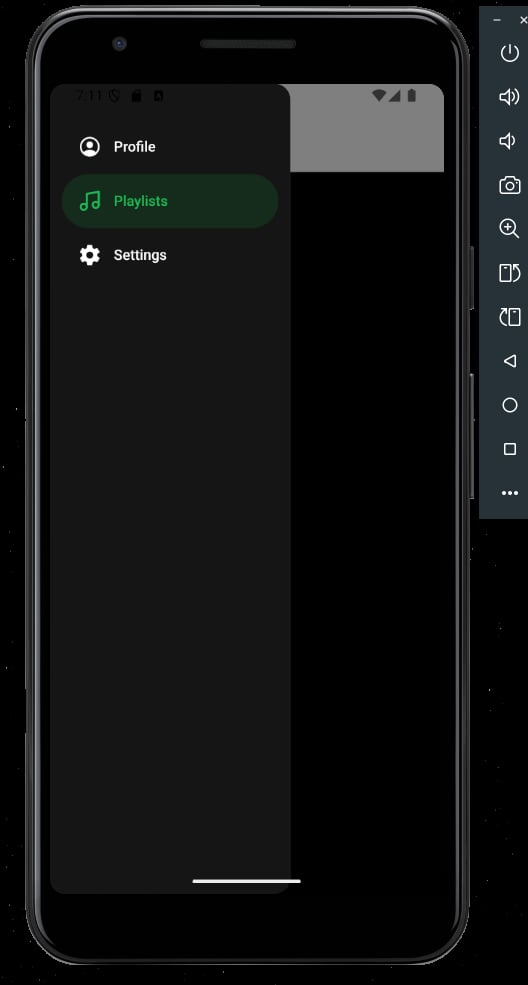
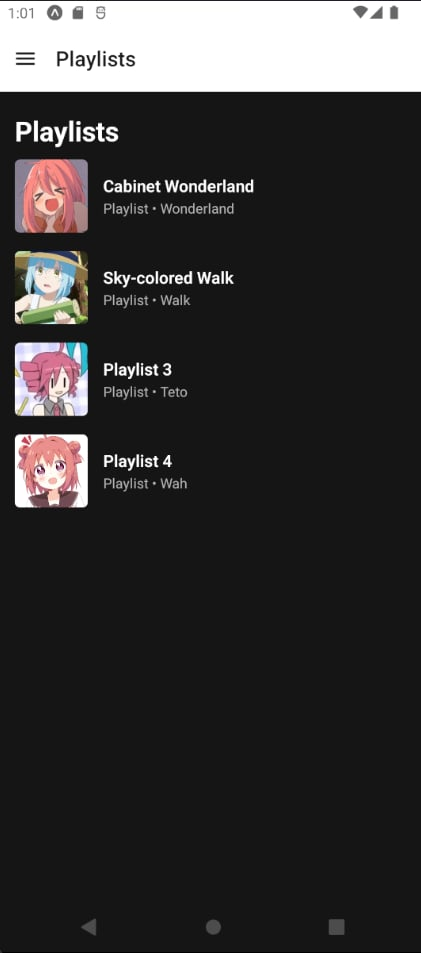
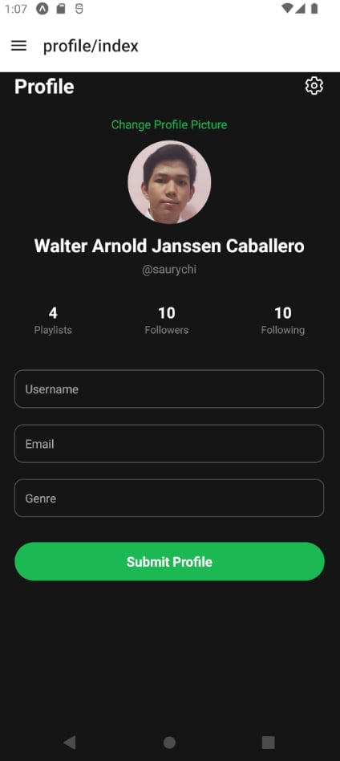
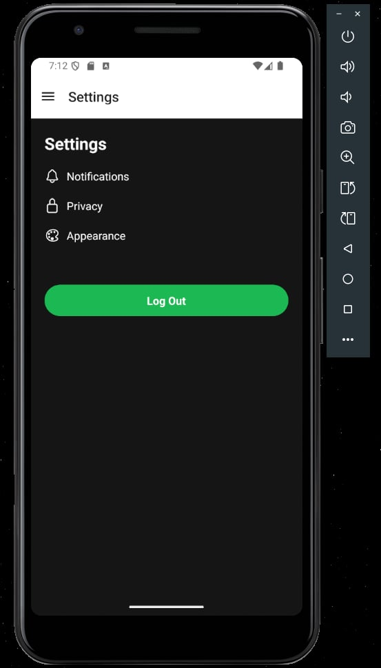
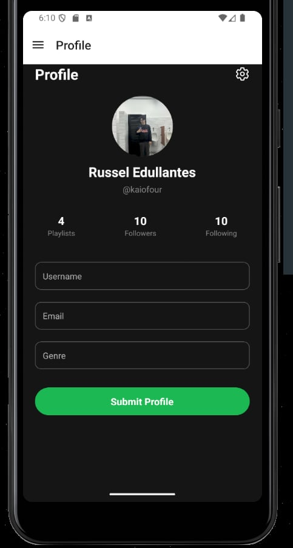
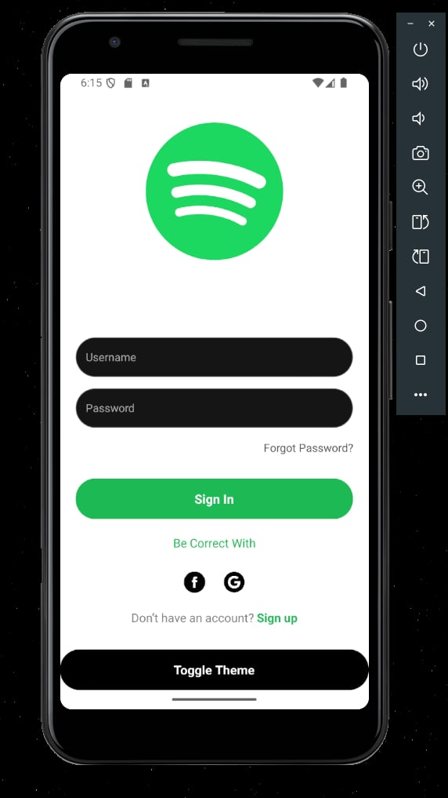
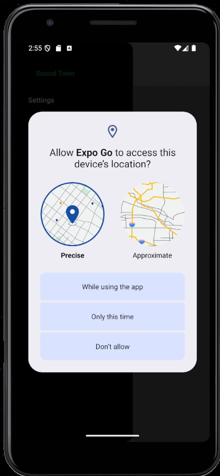
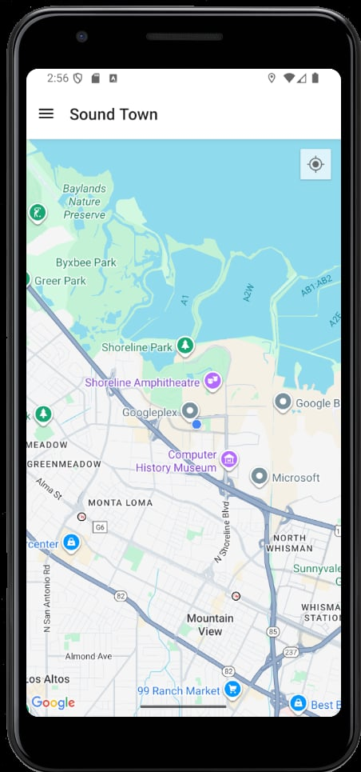

📱 App Overview

The app uses a stack navigator to manage transitions between the sign-in, sign-up, profile, playlists, and settings screens.
A custom drawer navigator styled with Spotify-like icons provides quick access to the Profile, Playlists, and Settings screens, while being hidden on the sign-in and sign-up screens to maintain proper flow.

<p align="center">      </p>
🧩 Week 4 – Activity 1
<p align="center">  </p>

Our state management approach used useReducer for handling complex playlist operations like add, remove, clear, and undo/redo, while AsyncStorage ensured playlists persisted across app restarts.
We structured the state into past, present, and future to support time-travel editing, and relied on useState only for lightweight inputs such as the new song field.
This separation made the app both clean and scalable.

🧩 Week 4 – Activity 2
<p align="center">  </p>

The validation logic runs in real time as the user types, checking that the username is 3–20 characters, the email has a valid format, and the genre matches the allowed list.
Errors are shown below input fields, and invalid inputs get a red border.
Reanimated’s FadeIn adds smooth transitions, while live state binding ensures instant updates in the profile preview.

🧩 Week 5 – Activity 1
<p align="center">  </p>

The theme was managed using a Redux store, with a darkMode state controlling app colors dynamically.
UI components switch between light and dark modes with animated transitions for a smoother, more natural experience.

🧩 Week 5 – Activity 2
<p align="center">    </p>

The camera functionality allows users to capture photos directly in the app using the device’s camera.
Users can switch between front and back cameras and save photos instantly.
APIs like Expo Camera make it easy to access these features across devices, enabling personalized and real-time content creation.

🧩 Week 6 – Activity 1
<p align="center">  </p>

Building the iOS version was challenging because we encountered issues with Expo and third-party packages.
Eventually, we managed to build successfully on iOS using Expo, but future tasks aim to build it without Expo to reduce dependency-related issues.

🧩 Week 6 – Activity 2
<p align="center">   </p>


The implemented map feature displays the user’s current location and several predefined landmarks on a map. It includes a geofencing functionality that triggers alerts when the user enters the vicinity of a landmark. One of the main challenges was ensuring compatibility across platforms, as using react-native-maps caused errors on web, requiring a switch to expo-maps. Additionally, implementing markers and geofencing without native-only components required custom logic and careful handling of location updates.


# Welcome to your Expo app 👋

This is an [Expo](https://expo.dev) project created with [`create-expo-app`](https://www.npmjs.com/package/create-expo-app).

## Get started

1. Install dependencies

   ```bash
   npm install
   ```

2. Start the app

   ```bash
   npx expo start
   ```

In the output, you'll find options to open the app in a

- [development build](https://docs.expo.dev/develop/development-builds/introduction/)
- [Android emulator](https://docs.expo.dev/workflow/android-studio-emulator/)
- [iOS simulator](https://docs.expo.dev/workflow/ios-simulator/)
- [Expo Go](https://expo.dev/go), a limited sandbox for trying out app development with Expo

You can start developing by editing the files inside the **app** directory. This project uses [file-based routing](https://docs.expo.dev/router/introduction).

## Get a fresh project

When you're ready, run:

```bash
npm run reset-project
```

This command will move the starter code to the **app-example** directory and create a blank **app** directory where you can start developing.

## Learn more

To learn more about developing your project with Expo, look at the following resources:

- [Expo documentation](https://docs.expo.dev/): Learn fundamentals, or go into advanced topics with our [guides](https://docs.expo.dev/guides).
- [Learn Expo tutorial](https://docs.expo.dev/tutorial/introduction/): Follow a step-by-step tutorial where you'll create a project that runs on Android, iOS, and the web.

## Join the community

Join our community of developers creating universal apps.

- [Expo on GitHub](https://github.com/expo/expo): View our open source platform and contribute.
- [Discord community](https://chat.expo.dev): Chat with Expo users and ask questions.
